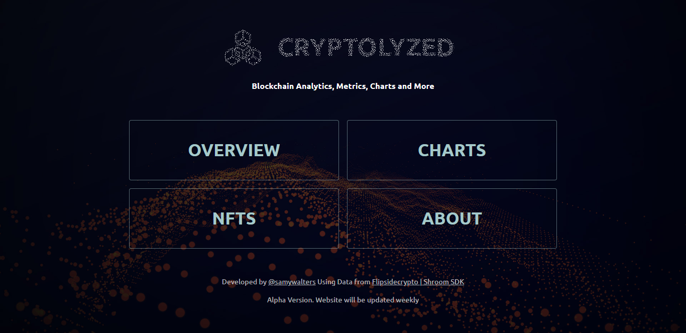
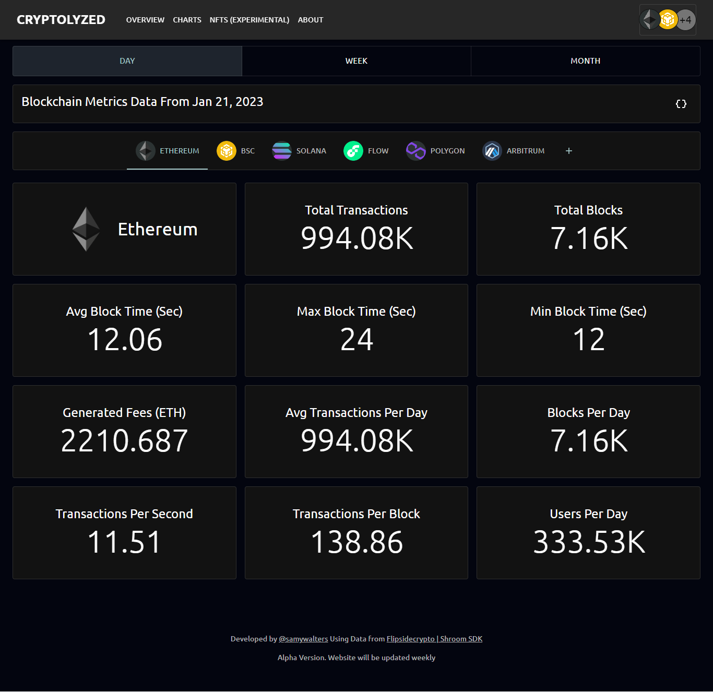
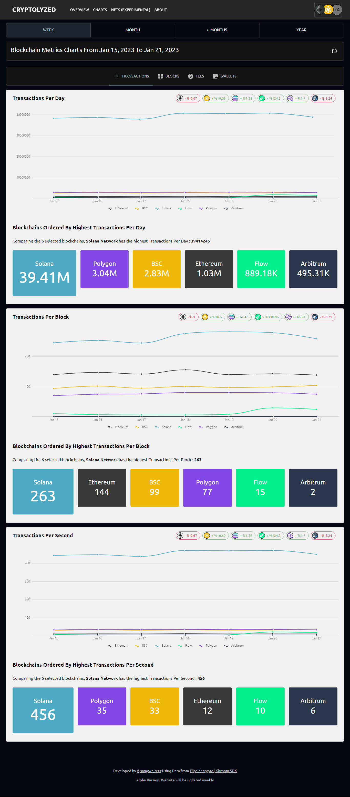

## Cryptolyzed

Blockchain analytics made using Vite & React for frontend and [Flipsidecrypto shroom sdk](https://flipsidecrypto.xyz/) for real blockchain data

### Some Screens of the app

<p align="center">

</p><p align="center">

</p><p align="center">

</p>

## :point_down: Getting Started

### Prerequisites

- [Node.js](https://nodejs.org/en/) v16.xx.x

### Run locally

1. Clone repo

   ```sh
   git clone https://github.com/sam-shariat/cryptolyzed.git
   ```

2. Install packages
   ```sh
   npm install or yarn install
   ```
3. Run application
   ```sh
   npm dev or yarn dev
   ```
4. Open development server on http://localhost:3000 or maybe another port!
